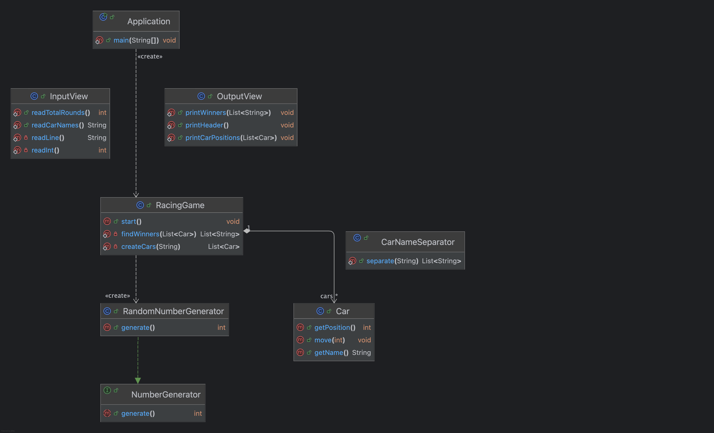
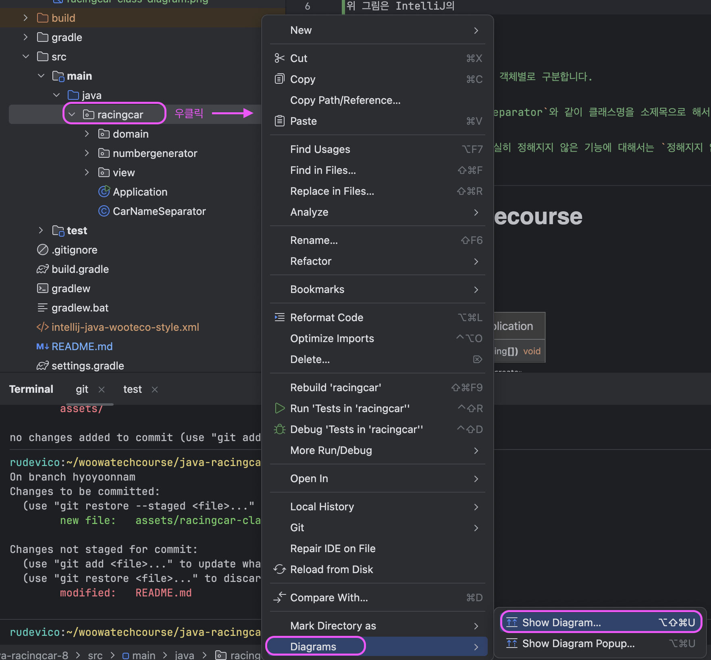

# java-racingcar-precourse

## 클래스 다이어그램


위 그림은 IntelliJ의 Show Diagram 기능을 이용해서 생성 후, 일부 수정을 거쳤습니다. 사용 방식은 아래를 참조하세요.



## 구현할 기능 목록
> [!NOTE]
> 구현할 기능 목록에 대해서 각 객체별로 구분합니다.
> 
> 기본적으로 `### CarNameSeparator`와 같이 클래스명을 소제목으로 해서 해당 객체의 책임이 되는 기능 리스트를 작성합니다.
> 
> 아직 어떤 객체의 책임인지 확실히 정해지지 않은 기능에 대해서는 `정해지지 않음` 소제목으로 분류합니다.

**용어 설명**
- 여기서 언급되는 `예외`는 모두 `IllegalArgumentException`이다.
- `검증`이란 리턴 타입이 `void`이고, 검증 성공시 정상 로직이 진행되며 실패시 `예외`를 발생시키는 메서드로 구현된다.
- `판단`이란 리턴 타입이 `boolean`이고, 조건에 대한 참 거짓을 리턴하는 메서드로 구현된다. 

### CarNameSeparator
- [x] 쉼표(`,`)를 기준으로 구분된 자동차 이름들의 문자열을 분리한다.
- [x] 분리된 각 요소의 앞 또는 뒤에 공백이 있다면 이를 제거한다.
  - 예. `" pobi , woni "`는 `[" pobi ", " woni "]`가 아니라, `["pobi", "woni"]`가 된다.

### Car
- [x] 자동차 이름에 사용할 수 있는 문자는 영문 대소문자와 ~~한글,~~ 숫자, 스페이스 문자 하나(`" "`), 언더 스코어(`"_"`) 하나만 가능하다. 이를 위반한 이름에 대해 `사용할 수 없는 이름` 또는 `invalid name`이라 하자. 해당 조건을 검증하고, 위반 시 `예외`를 발생시킨다.
  - 한글을 제외한 이유: [여기](https://helia-17.tistory.com/16)를 확인해 보니, 한글에 대한 정규표현식을 사용하려면 단순히 패턴을 정의하는 것뿐만 아니라 맥과 윈도우의 인코딩 차이도 고려해야 된다. 이 부분에 시간을 꽤 써야될 것 같아 일단 보류.
- [x] 자동차 이름이 5자 이하인지 `검증`한다. 5자를 초과하면 `예외`를 발생시킨다.
- [x] ~~0에서 9 사이의 무작위 값을 구해~~값이 4 이상이면 전진한다. 아니라면 정지한다.
  - '조건에 따른 전진'이라는 책임을 `RacingGame`과 `Car` 중에 누가 가져야 하는가에 대한 의문이 생겼다. 결론적으로 '전진'이라는 추상적 책임을 `Car`가 가지는 것이 적절하므로, 해당 책임 역시 `Car`가 가지도록 한다.
  - (중요!) 하지만 '무작위 값을 구하는 책임'까지 지우면 그 기능을 테스트하기 어렵다(랜덤 값에 의존하기 때문이다). 따라서 무작위 값 생성 자체는 외부(`RacingGame`)에서 주입하도록 하는 것의 테스트 작성에 용이하다.

### RacingGame
- [x] 정상적인 입력에 대해 게임을 성공적으로 생성할 수 있다.
- [x] 경주에 참가할 자동차 이름과 시도할 횟수를 입력 받는다.
- [x] 게임을 시작할 수 있는지 검증한다.
  - [x] 참가할 자동차가 2개 미만이라면, 게임을 시작할 수 없다. 위반시 `예외`를 발생시킨다.
  - [x] 게임에 참가하는 자동차들은 이름이 서로 동일할 수 없다. 즉, 중복이 존재하면 안 된다. 중복이 존재하면 `예외`를 발생시킨다.
    - 이 기능에 대한 책임을 가지는 객체를 정하기가 고민됐는데, 일단 `CarNameSeparator`는 단순히 '분리'의 책임만을 가지면 되기 때문에 중복 불가라는 제한을 가지기에는 애매하다고 판단했다.
  - [x] 게임은 최소 1회차 진행되어야 한다.
    - 즉, `시도할 횟수`가 ~~입력되지 않거나~~ `1` 미만이라면 `예외`를 발생시킨다. 
- [x] 게임을 진행하면서 각 회차의 결과를 출력한다. -> `OutputView`에게 요청
- [x] 게임이 끝나면 우승자를 출력한다. -> `OutputView`에게 요청

### 정해지지 않음
_nothing_

## 설계
> [!NOTE]
> 
> 해당 섹션은 `문제 파악하기 섹션`을 진행한 이후에 작성됩니다.
> 
> `문제 파악하기 섹션`에서는 문제를 파악하는 수준에서 할 수 있는 간단한 설계를 했다면,
> 해당 섹션에는 책임에 대한 객체, 변수명, 메서드명 등 더 세부적인 내용들을 고려한 좀 더 고차원적인 설계를 합니다.

### 1. 초기 구상


### 2. `RacingGame` 객체


### 3. 외부로 공개되지 않는 기능을 테스트하는 방법을 고민


### 4. '게임 시작'에 대한 메서드명이 적절한지 고민


### 5. RacingGame의 start 메서드 내부에서 각 라운드를 진행하고, 결과를 출력하는 흐름


콘솔 출력에 대한 테스트는 [여기](https://www.geeksforgeeks.org/advance-java/unit-testing-of-system-out-println-with-junit/)에서 소개하는 방법으로 하면 되겠다.

### 6. 랜덤 값에 의존하지 않고 테스트 하려면
다른 구현들을 대부분 마치고 RacingGame이 각 회차의 결과와 최종 우승자를 출력하는 요구 사항에 대한 구현이 남은 상태다.

그런데 결국 실제 `RacingGame.start` 메서드는 랜덤 값에 의존하기 때문에 테스트 일관성이 보장되지 않는다.

이런 상황에서 mock이나 stub을 쓴다고 주워 듣기는 했는데, 정확한 해결 방안은 모르기 때문에 일단 이에 대한 학습을 먼저 진행한다.

**결론:** 결국 외부 API를 통해 랜덤 값을 생성하는 로직이 문제다.
그렇다면, 테스트 때는 랜덤성에 의존하지 않을 수 있도록 해당 로직에 대한 '대체 가능성'을 부여해주면 된다.
가장 간편하고 안전한 방법은 생성자 주입이다.

테스트에서는 경계값 등을 테스트 하면 되므로, 랜덤이 아니라 지정한 고정 숫자를 생성하는 `FixedNumberGenerator`를 만든다.

또한 대체 가능성을 위해서는 상위 부모 타입(인터페이스 포함)을 가져야 되는데, 미션에서 제공되는 `Randoms` 라이브러리는 인스턴스 생성이 불가능하므로 이를 래핑하는 `RandomNumberGenerator`를 만든다.

`XxxNumberGenerator`는 `NumberGenerator` 인터페이스의 구현체이다.

### 7. Console 라이브러리에 대한 래핑
'외부 라이브러리는 래핑해서 사용하는 것이 좋다' 정도로만 막연히 알고 있었다.

1주 차 미션에서는 위 사실을 알고 있었으나, 필요성이 느껴지지 않는 상태에서 무작정 래핑하는 것은 오히려 학습에 악영향을 미칠 수도 있겠다 생각하여
그대로 사용했었다.

그런데 고맙게도 이번 2주 차 미션에서 그 필요성이 생겼다! 아마도 의도된 것이 아닐까... 하는데, 개인적으로 문제에서 특히나 잘 의도된 부분이라고 생각한다.

거두절미 하고, 그 필요성은 다음과 같다.

```java
String line = Console.readLine(); // 문자열은 그냥 받으면 된다.
int intLine = Integer.parseInt(Console.readLine()); // 숫자형으로 받으려면 타입 변환이 요구된다.
```
위 상황처럼 숫자형으로 받아야 할 필요가 있을 때 다음 두 가지 해결책을 생각할 수 있다.
1. `Application`에서는 타입 변환에 신경쓰지 않도록, 그냥 `Console.readLine()`으로만 받고, `RacingGame`에서 `String`으로 받은 숫자형 문자열을 숫자로 변환해서 사용한다.
2. `Application`에서 타입 변환까지 신경써서, `RacingGame`은 받은 값 그대로 사용한다.

그런데 내 생각에 1번은 입력한 값에 대한 타입(문자열)이 실제로 기대되는 값(숫자형)과 매칭되지 않는 문제가 있다.

그리고 2번은 `Application`은 '사용자로부터 입력을 받는 것'만 신경쓰면 되지, 굳이 타입 변환까지 신경써야 되나? 싶은 문제가 있다.

여기서 `Console.readLineAsInt()` 또는 `Console.readInt()`처럼 숫자형 문자열을 받는다는 의미가 명확한 기능에 대한 필요성을 느꼈다.

그런데 `Console` API 자체는 외부 라이브러리이기 때문에, 우리가 직접 기능을 추가하기 어렵다. 대신 이를 래핑하는 객체를 만들면 된다!!!

예를 들어, `MyConsole`을 직접 구현하는데, `MyConsole.readLine()`은 `Console` API를 그대로 호출하는 프록시로 동작하게끔 하고,
`MyConsole.readLineAsInt` 역시 타입 변환에 대한 추가 처리를 하고, `Console` API를 호출하도록 하면 된다.

해당 주차 미션에서 `Randoms` API는 이미 `NumberGenerator`로 래핑해서 사용했는데, 그때는 '테스트 용이성'을 위해서 래핑을 생각해냈다.

그런데 `Console`의 경우에는 '기능의 확장'을 위해서 래핑을 진행했고, [이 블로그](https://full-of-bluff.tistory.com/19)로부터 힌트를 얻을 수 있었다.

래핑이라는 동일한(?) 행위지만, 그 목적과 필요가 다르다는 점이 "나는 정말 필요에 의해서 새로운 방법을 학습하고 있어!"라는 자신감을 내게 주어 특히나 좋았던 부분이다.

## 문제 파악하기
> [!NOTE]
> 
> 해당 섹션은 문제를 분석하고 `구현할 기능 목록`을 만들기 이전 시점에 작성됩니다.
> 
> 문제에 대한 본격적인 분석 전, 간단하게 '문제를 파악'하는 정도로만 훑어보며 의문 사항이나 문제 흐름을 정리하는 것이 목적입니다.
> 
> 기본적으로 '구현할 기능 목록을 만들기 전' 시점에 작성되지만, 필요에 따라 그 이후 시점에도 내용이 추가될 수 있습니다.

### 의문 사항
#### 1. '전진'의 단위는?
구한 무작위 값이 4 이상이면 전진하는 것은 알겠는데, 다음 두 경우 중 무엇일까?
- 경우1: 무조건 한 칸
- ~~경우2: 숫자 크기만큼(4 ~ 9)~~

결론적으로 `경우1`로 판단한다. 근거는 다음과 같다.
- 주어진 `ApplicationTest`의 `기능_테스트` 메서드를 보자.
  - pobi는 4, woni는 3일 때 pobi에게 한 칸의 `-`가 주어졌다.
  - "4를 한 칸 전진 기준으로 하고, 수가 1만큼 더 커질 때마다 1칸 더 전진하는 로직일 수도 있지 않냐?"라고 반문 할 수 있다.
    - 하지만 이는 너무 비약적인 논리다. 이렇게 판단할 근거는 없다. 다른 근거가 더 추가되지 않는 이상 현재 판단을 유지하는 것이 타당하다.

즉, 초기에는 각 자동차가 빈 문자열로 각각 시작하고 / 전진했다면 이전 상태 + 한 칸 / 정지했다면 이전 상태로 해서 출력하는 논리로 보인다.

#### 2. "전진하는 자동차를 출력할 때..."라는 요구사항
처음에는 해당 요구 사항이 '전진하는(4 이상이 나온) 자동차의 상태만 출력하라'는 것인 줄 알았으나 아니다.

그냥 각 회차의 자동차들 상태(총 이동 거리)를 출력하면 된다. 근거는 다음과 같다.
- '실행 결과 예시'에서 첫 회차의 결과를 보면 woni는 전진하지 않았는데 출력에 포함된다.

#### 3. 실행 결과는 한 번에 출력할까? 아니면 실시간으로 출력할까?
두 방법 중 자율적으로 선택하면 될 줄 알았으나, 실시간으로 출력하는 것으로 판단한다. 생각의 흐름은 다음과 같다.
- 출력과 관련하여 "...요구 사항에 명시된 출력 형식을 따르지 않으면 0점을 받게 된다."는 명시가 있다.
- 만약 한 번에 출력하는 것으로 구현한다고 할 때, 사용자가 매우 큰 이동 횟수를 입력해서 최종 출력까지 30초가 걸린다고 가정하자.
  - 이때 사용자는 30초 동안 프로그램이 제대로 진행 중인 것인지, 렉이 걸려 먹통인 것인지 알 수가 없다. 이는 사용자에게 최악의 경험을 준다.
  - 결과 자체는 최종적으로 출력하더라도 'n회차 진행중...'이라는 진행 사항 정도만 띄워주도록 해서 이 경험을 개선할 수 있지만, 출력 요구 사항을 준수해야 되기 떄문에 제한된다.

### 프로그램에 등장하는 요소
- 자동차
  - 자동차는 이름을 가진다(5자 이하로 제한).
  - 자동차는 이동한 거리를 가진다.
  - 자동차는 전진 여부를 결정하기 위해 무작위 값을 정할 수 있다.

- 우승자
  - 우승자는 자동차들 중 최종적으로 이동한 거리가 가장 큰 자동차(들)이다. 여러 명이 우승할 수 있다.

- 시도할 횟수

#### 객체 지향 세계로의 매핑을 고민
`시도할 횟수`만큼 내부 로직을 반복해야 하므로 해당 값을 변수로 관리하기로 결정한다.

그렇다면, **어떤 객체가 관리**해야 될까?
- ~~자동차~~
  - `시도할 횟수`는 모든 자동차가 그 값조차 동일하게 가진다. 따라서 개별 자동차 객체가 가져야 될 속성은 아니다.
  - 모든 자동차가 값을 공유하기는 하지만, 자동차 자체에 대한 속성도 아니다. 따라서 자동차 클래스가 `static`으로 가져야 될 속성도 아니다.
- 레이싱 진행자 (객체의 임시 명칭)
  - 해당 프로그램은 결국 '레이싱 게임'에 대한 구현이 핵심이다. 레이싱 게임은 `시도할 횟수`만큼 차수를 진행한다. 즉, 레이싱 게임의 진행과 관련된 값으로 구분할 수 있고 레이싱 진행자가 관리하는 것이 적절하다.
  - 또한 레이싱 진행자가 레이싱에 참가하는 자동차 인스턴스들도 관리하는 것이 좋겠다.
  - 각 자동차 인스턴스에 대한 차수별 실행 결과와 최종 이동 거리를 비교해서 우승자를 가리는 것도 해당 객체가 책임진다.
    - '출력'에 대한 것은 필요한 값을 전달 받아 출력하는 별도의 객체가 책임지는 것이 적절할 수도 있겠으나, 일단은 이 정도로만 고민한다.

### 사용자와 Application 접점
사용자는 `Application`에게 쉼표로 구분한 자동차 이름과 시도할 횟수를 전달한다. 이에 대해 프로그램이 차수별 실행 결과와 최종 우승자를 콘솔에 출력해주는 것을 기대한다.

즉, 내부적으로 어떤 로직으로 진행해야 하는지는 사용자가 신경쓰지 않는다.

### 프로그램 흐름도
일단 개별 객체로 구분하지 않고, 크게 사용자와 프로그램 둘로만 나누어서 프로그램의 흐름을 작성했다.


## 2주 차 목표
> [!NOTE]
> 
> 해당 섹션은 1주 차를 진행하면서/마치고 느낀 아쉬운 부분들을 2주 차에는 놓치지 않기 위해서 리마인드 하기 위함입니다.

### 스스로 느낀 부분
- [x] JUnit이 제공하는 `@ParamterizedTest` 애노테이션 사용하기
  - 테스트 메서드 하나에 비슷한 여러 케이스를 넣고 싶을 때, 메서드 바디 부분을 더럽히지 않고 추가할 수 있다.
  - `@CsvSource`는 `String`에 특화되어 있고, `@ValueSource`는 추가로 숫자 타입 정도까지 커버가 가능하다. 만약 `List` 등의 참조형 객체가 필요하다면 `@MethodSource`가 적절하다.
- [x] 학습 레퍼런스 남기기
- [x] 코드 컨벤션을 지키기 위해 extension 등을 이용하기
  - [woowacourse-docs 리포지토리](https://github.com/woowacourse/woowacourse-docs/tree/main/styleguide/java)를 참고해서 로컬 인텔리제이에 코드 포매터를 적용했다.
- ~~테스트 메서드명에 snake_case 사용하지 않기~~
  - [Java Style Guide](https://google.github.io/styleguide/javaguide.html#s5.2.3-method-names)에서 테스트 메서드명에서는 lowerCamelCase와 함께 언더 스코어(`_`)의 사용을 허용하고 있음을 확인했다.
  - [x] 대신 `methodName_expectedBehavior_stateUnderTest` 구조로 네이밍하기로 한다.

### 공통 피드백 참고
- [ ] 배열 대신 컬렉션 사용하기
  - 1주 차에서 리팩터링을 통해 대부분의 배열을 컬렉션으로 변경했으나, 변경하지 못한 부분이 있었다.
- 커밋 메시지에 대해서
  - [x] 제목은 명령조로 작성, 마침표(.) 금지
    - 한글 명령조로 작성하려면 '~한다', '~함' 등으로 하면 되겠다.
    - '~ 변경', '~추가'와 같은 명사형이나 '~추가했다'와 같은 과거형은 지양한다.
  - [x] 본문은 '어떻게'보다 '무엇을', '왜'에 맞춰 작성하기
- [ ] 어려운 부분이 있다면, 테코톡에서 다룬 영상이 있는지 우선적으로 확인하기

### PR 리뷰 참고
- [x] [예외를 남길 땐 단순 메시지 뿐만 아니라, 문제가 발생한 값도 포함해주기](https://github.com/woowacourse-precourse/java-calculator-8/pull/530/files/802c242348735f9ea082658ea90654576ea8525f#r2448583808)
- [ ] [null 체크가 필요하다면, Objects.requireNonNull을 사용하고, 예외는 래핑하기](https://github.com/woowacourse-precourse/java-calculator-8/pull/113#discussion_r2450380973)

## References
[JUnit Parameterized Tests](https://www.baeldung.com/parameterized-tests-junit-5)

[Unit Test Naming Conventions](https://medium.com/@stefanovskyi/unit-test-naming-conventions-dd9208eadbea)

[Pattern, Matcher 클래스](https://docs.oracle.com/javase/8/docs/api/java/util/regex/Pattern.html)

[프론트엔드의 한글 정규식, 어떻게 쓸 것인가](https://helia-17.tistory.com/16)

[좋은 코드를 위한 자바 변수명 네이밍 - 변수 이름에 자료형이 들어간다면?](https://tecoble.techcourse.co.kr/post/2020-04-24-variable_naming/)

[코딩 명명 규칙 시 주의해야 할 영어 단어](https://blog.naver.com/posionsnake/222146800990)

[Unit Testing of System.out.println() with JUnit](https://www.geeksforgeeks.org/advance-java/unit-testing-of-system-out-println-with-junit/)

[import static과 import 순서](https://arc.net/e/BC3ED568-BD92-46C3-AC6C-DCDD160B687C)